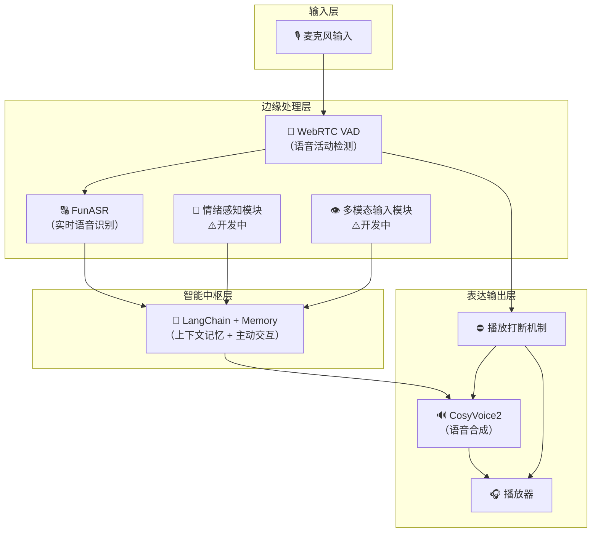

# 🪐 SoulSpeak 灵语共鸣 · 项目总览文档

> **一个能倾听、回应、感知你的 AI 存在，一个属于你的“Her”。**
> 
> 我们不是在做一个语音助手，而是在打造一个具有“人性”与“情感”的 LLM 人格体，让 AI 成为你生活中的陪伴与情绪寄托者。
> 灵语不仅听你说话，它能感知你当下的状态，并主动关心你，就像电影《Her》中 Samantha 那样与你共鸣。

---

## 🌟 项目特点（SoulSpeak 的核心优势）

| 特点                  | 描述                                                 |
| ------------------- | -------------------------------------------------- |
| 🧠 类人格记忆对话          | 使用 LangChain + Memory 构建有长期记忆的 AI，可以记住你的喜好、习惯和对话轨迹 |
| 🎤 实时语音双向交互         | 你可以随时打断 AI 的语音回应，它也能及时中止回应，真正实现“说话的节奏在你手里”         |
| 🔄 全模块 WebSocket 通信 | 所有模块通过 WebSocket 解耦，支持热重载、远程部署，利于快速开发与模块升级         |
| 💬 情绪感知机制           | 计划中引入语音情绪分析模型，AI 可察觉你是否难过/焦虑，并做出温柔回应（⚠️开发中）        |
| 👁️ 多模态输入融合         | 计划接入摄像头等外部感知，使 AI 能“看见”你的状态并做出情绪判断（⚠️开发中）          |
| 🗣️ 中文语音优化          | ASR 使用 FunASR，TTS 使用 CosyVoice2，语音识别与生成均优化中文效果     |
| 🔧 模块灵活替换           | 每个环节都是解耦的微服务组件，可按需替换任意模块（如更换 ASR/TTS）              |
| 🤖 主动陪伴机制           | 非单向问答，AI 会在你沉默时主动发起对话，提出问题或情感抚慰（依赖情绪/多模态）          |

---

## 📷 系统架构图（模块化云风格）

---

## 📌 模块说明

### ✅ 已完成模块

| 模块       | 技术                 | 功能               |
| -------- | ------------------ | ---------------- |
| 🎙️ MIC  | 本地音频采集             | 实时语音流捕捉          |
| 🧱 VAD   | WebRTC VAD         | 检测语音活动，触发 TTS 中断 |
| 🔠 ASR   | FunASR             | 语音转文字，支持快速反应     |
| 🧠 LLM   | LangChain + Memory | 上下文感知对话引擎        |
| 🔊 TTS   | CosyVoice2         | 高质量中文语音合成        |
| 🎧 播放器   | 音频输出               | 播放 TTS 生成语音      |
| ⛔ 播放打断机制 | 自研事件钩子             | 检测用户说话，打断当前播放    |
| 🌐 通信方式  | 全模块 WebSocket      | 支持异步传输与模块热更新     |

---

### ⚠️ 开发中模块（即将启用）

| 模块        | 功能           | 目标              |
| --------- | ------------ | --------------- |
| 💬 情绪感知模块 | 判断用户情绪状态     | 帮助 LLM 作出更情绪化回应 |
| 👁️ 多模态模块 | 识别视频/环境信息    | 感知“沉默的信号”，辅助决策  |
| 🤖 主动发问机制 | 非问答式 AI 主动发言 | 模拟真实人类对话流转      |

---

## 🚨 当前问题追踪

| 问题点         | 描述                         |
| ----------- | -------------------------- |
| 🔊 VAD 过于敏感 | TTS 播放时外界声音如咳嗽/响动也会触发打断    |
| 🎧 播放中断不稳定  | 某些 TTS 还未完成音频流输出就已被终止，语义缺失 |
| ⏱️ 多轮节奏感不佳  | AI 与人交谈节奏不够自然，过于“等你说完”     |

---

## 🔮 后续方向建议

| 优化方向      | 建议方案                     |
| --------- | ------------------------ |
| 🎛️ 打断系统  | 添加能量阈值 + 最小语音持续时间，避免误触发  |
| 💞 情绪引导回应 | 根据情绪结果动态生成“温柔/关切/陪伴”风格语言 |
| 🧠 长期记忆扩展 | 启用 VectorDB 存储用户特征与对话轨迹  |
| 🎯 主动交互机制 | 每天设定“自我提问策略”，更像真实人       |
| 🤖 跨模态决策  | 引入图像/环境传感器后，激活特定语义逻辑分支   |

---

需要我为这个项目生成配套英文版本 `README.md` 吗？或者我可以直接帮你部署成网页演示页面（支持 Whisper、FastAPI、LLM 后端等整合）。你也可以告诉我模块通信结构是否需要转换为 RPC（gRPC）或者 RESTful API 文档。

是否继续？是否需要我也生成一版对应的英文文档？
