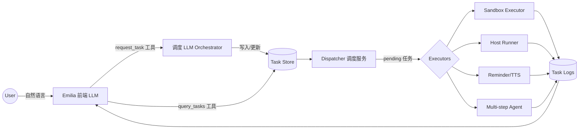
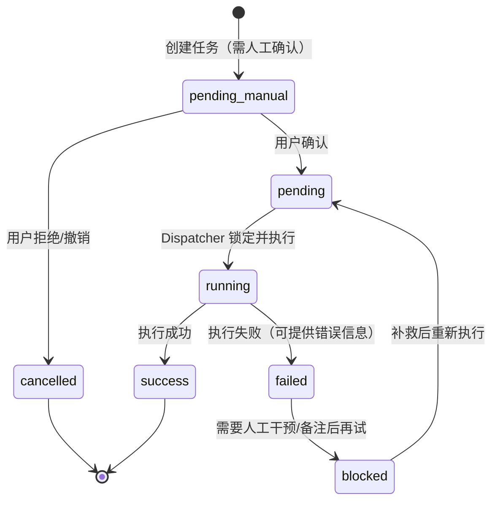
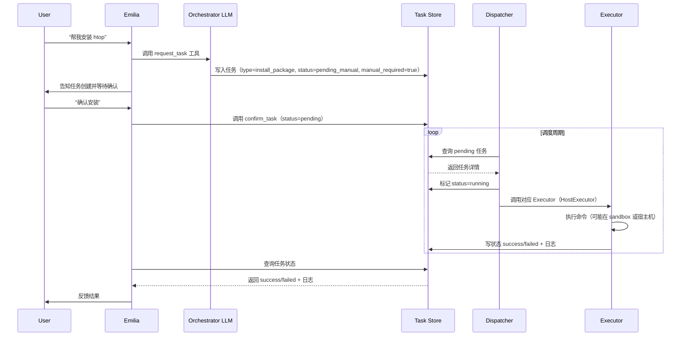

# SoulTask Orchestrator 框架说明

## 1. 总览

SoulTask Orchestrator（STO）是 SoulSpeak 体系内负责“把想法落地为行动”的任务枢纽。它把对话 LLM（Emilia）、任务调度、沙箱执行等模块串联在一起，让“提醒”“运行脚本”“安装软件”等需求能够被可靠执行、记录与追溯。

核心理念：

1. **前端对话轻量化** —— Emilia 专注于快速交流，不直接执行命令；
2. **调度智能模块化** —— 独立的调度 LLM（Orchestrator）负责解析意图、创建/更新任务；
3. **执行安全可控** —— Dispatcher + Executors 组合保证动作在可追踪、可审计的环境内完成；
4. **状态全程可观测** —— 任务与日志集中存储，Emilia 随时可以查询并向用户反馈。

### 1.1 组件架构



## 2. 组件职责

| 组件 | 角色 | 职责 |
| --- | --- | --- |
| Emilia | 对话前端 | 识别用户意图，调用工具 `request_task` / `list_tasks` / `task_detail`，同步记忆与反馈 |
| 调度 LLM Orchestrator | 任务规划 | 将自然语言需求转为结构化任务（`task_type`、`payload`、`manual_required` 等），写入 Task Store |
| Task Store | 真相来源 | SQLite/Postgres 等，存储任务主体、状态、时间戳、结果摘要；另含 `task_logs` 记录执行细节 |
| Dispatcher | 常驻调度器 | 轮询/订阅 Task Store，挑选 `status=pending` 的任务，锁定后分发给合适的 Executor |
| Executors | 执行器集合 | 根据 `task_type` 执行动作，采集 stdout/stderr/产物，更新任务状态与日志 |
| Task Logs | 审计与追踪 | 保存状态流转、stdout、stderr、人工确认记录，供 Emilia/用户查询 |

### 2.1 Executor 分类示例

| Executor | 适用任务 | 行为 |
| --- | --- | --- |
| ReminderExecutor | `reminder` / `notification` | 到点调用 `play_sentences` 或其他通知渠道 |
| LLMExecutor | `llm` / `plan_and_execute` / `qa` | 基于模板渲染提示、调用 LLM 代理，记录 prompt/响应/指标，可配置输出过滤与重试 |
| SandboxExecutor | `run_code` / `data_analysis` | 通过 gVisor/Docker+Jupyter 执行代码，返回 stdout/图像 |
| HostExecutor | `install_package` / 系统操作 | 需要人工确认，使用白名单命令或模板化脚本执行，严格记录结果 |
| AgentExecutor | `plan_and_execute` / 复杂流程 | 触发子 LLM + Sandbox 的多步执行（例如生成计划、逐步运行、验证） |

## 3. 任务生命周期

### 3.1 状态机



### 3.2 表结构建议

`tasks` 表核心字段：

| 字段 | 类型 | 说明 |
| --- | --- | --- |
| `id` | TEXT/UUID | 任务 ID |
| `type` | TEXT | 任务类型（如 `reminder`、`run_code`、`install_package`） |
| `payload` | JSON | 参数（命令、时间、脚本等） |
| `status` | TEXT | `pending_manual` → `pending` → `running` → `success/failed/blocked/cancelled` |
| `manual_required` | BOOLEAN | 是否需要人工确认 |
| `scheduled_for` | DATETIME | 定时执行时间（提醒类任务用） |
| `created_at` / `updated_at` / `executed_at` | DATETIME | 生命周期时间戳 |
| `result` | JSON/TEXT | 摘要结果（stdout 关键行、文件路径等） |
| `error` | JSON/TEXT | 失败原因（包含 stderr 片段） |
| `confirmation_note` | TEXT | 用户确认/拒绝理由 |
| `attempts` | INTEGER | 执行次数（重试用） |

`task_logs` 表用于记录细粒度事件（状态变更、stdout、stderr、人工确认等），字段包含 `task_id`、`event`、`timestamp`、`data`（JSON/text）。

## 4. 请求与执行流程

### 4.1 任务创建 & 执行顺序图



## 5. 人工确认与安全策略

1. **高危任务默认 `manual_required=true`**：如 `install_package`、`modify_system`。
2. **确认操作**：通过工具或界面将 `status` 从 `pending_manual` 改为 `pending` 并写 `confirmation_note`；拒绝则设为 `cancelled`。
3. **执行白名单**：HostExecutor 仅接受经审核的命令模板，如 `brew install ...`、`apt-get install ...`，并记录完整 stdout/stderr。
4. **失败处理**：若执行失败，Executor 将状态设为 `failed` 并写 `error`；调度器可根据策略自动重试，或将任务转为 `blocked` 以等待人工处理。
5. **安全隔离**：沙箱执行器使用 gVisor/Docker + Jupyter Kernel；HostExecutor 在确认后执行，并可结合 sudo 权限分级或独立服务守护。

## 6. 任务查询与反馈

- Emilia 可通过工具 `list_tasks(status=...)`、`task_detail(task_id)` 获取任务列表与详细日志；
- `Task Logs` 可以提供 stdout/stderr 摘要、文件产物链接等，保证每次执行可追踪、可复盘；
- 对于长期任务或失败任务，Emilia 会主动提醒用户处理（例如 `blocked` 状态）。

## 7. 落地路线建议

1. **最小可行产品**
   - ✅ 建立 DuckDB Task Store（`soul_speak/sto/store/duckdb_store.py`）与 `tasks`/`task_logs` 表；
   - ✅ 实现 Dispatcher（APScheduler 轮询）+ `ReminderExecutor` + `SandboxExecutor`（默认关闭，使用 `scripts/sandbox_runner.py` 执行并校验允许路径） + `LLMExecutor` + `AgentExecutor`；
   - ✅ 接入调度 LLM 工具（FastMCP `sto_schedule_task`）让 Emilia 能创建/确认/查询任务。

2. **扩展阶段**
   - 增加 HostExecutor（高权限操作，需人工确认和白名单）；
   - 引入 AgentExecutor 处理复杂多步骤任务（子 LLM + sandbox）；
   - 设计简单的 Web/CLI 面板，方便人工查看和确认任务。

3. **高级优化**
   - 将 Task Store 迁移至 Postgres，利用 LISTEN/NOTIFY 降低延迟；
   - 引入队列（如 Huey/RQ）处理执行压力与重试；
   - 视安全评估结果补充 SandboxExecutor，实现高危命令的隔离执行；

## 8. 当前实现要点

- **调度器 (`soul_speak/sto/scheduler.py`)**：基于 `AsyncIOScheduler` 周期性扫描 DuckDB/Memory Task Store，自动将 `status=pending` 且到期的任务分发给匹配执行器。执行成功后，如 `payload.interval_seconds` 存在，会将任务重新排期为下一次触发，并重置状态/错误信息。
- **自动化工具 (`sto_schedule_task`)**：在 `soul_speak/llm/tools/toolkit.py` 中暴露为 FastMCP 工具，LLM 可传入 `task_id`、`task_type`、`payload`、`delay_seconds`/`scheduled_for`、`interval_seconds` 等字段，实现“创建或更新 STO 任务”的全自动流程。
- **DuckDB 审计**：调度器在 `task_logs` 表写入 `scheduler_dispatch`、`scheduler_error`、`scheduler_rescheduled` 等事件，便于追踪每一次执行和重新排期的时刻、状态与执行器。
- **循环任务案例**：LLM 接收到类似“每小时播报一次当前时间”的需求时，可调用 `sto_schedule_task`，传入 `{"command": ["date"], "interval_seconds": 3600}` 等参数，调度器会持续按小时执行并记录结果，无需人工干预。
   - 建立统一的审计与通知系统，对 task 结果触发 TTS/消息推送。
- **Sandbox Executor**：默认使用 `scripts/sandbox_runner.py` 运行脚本，通过环境变量 `SANDBOX_ALLOWED_ROOTS` 校验脚本路径；启用前必须在 `conf/sto/scheduler.yaml` 中配置允许目录与命令白名单。
- **Agent Executor**：支持 `agent_plan` 任务回放 note/sleep/command 步骤；Command 步骤仅允许运行配置的安全命令列表，并记录 stdout/stderr 片段到任务日志。
- **LLM 工具链聚合**：STOSchedulerService 会自动将 Host/Sandbox/Agent/SystemUsage 执行器注册到 LLMExecutor 的 `tool_registry`，规划步骤可直接调用对应执行器。

### Sandbox Runner 使用示例

```bash
# 允许 STO 执行 scripts/safe_task.py（通过 sto_schedule_agent_plan 工具）
python -m soul_speak.llm.tools.toolkit sto_schedule_agent_plan \
  --task-id sandbox-demo \
  --steps '[{"type": "command", "command": ["python", "${hydra:runtime.cwd}/scripts/safe_task.py"]}]' \
  --summary "运行安全脚本"

# 在 conf/sto/scheduler.yaml 中启用：
# executors.sandbox.enabled: true
# executors.sandbox.command: ["python", "${hydra:runtime.cwd}/scripts/sandbox_runner.py"]
# executors.sandbox.allowed_paths: ["${hydra:runtime.cwd}/scripts"]
```

`sandbox_runner.py` 会自动判断目标是否在允许目录内，若目标是 Python 脚本则使用当前解释器运行，并返回详细的退出码供日志审计。Emilia 可通过 `sto_list_tasks` 查看最近任务，使用 `sto_task_detail` 查询单个任务的结果和日志。

### Agent Executor 计划任务示例

```bash
python -m soul_speak.llm.tools.toolkit sto_schedule_agent_plan \
  --task-id agent-plan-demo \
  --steps '[{"type": "note", "message": "准备执行"}, {"type": "command", "command": ["python", "-c", "print(\\"agent plan ok\\")"], "timeout": 10}]' \
  --summary "定时播报状态" \
  --delay-seconds 5

# 查询执行状态
python -m soul_speak.llm.tools.toolkit sto_list_tasks --status success --db-path data/sto_tasks.duckdb
python -m soul_speak.llm.tools.toolkit sto_task_detail --task-id agent-plan-demo --db-path data/sto_tasks.duckdb --log-limit 20
```

启用前需在 `executors.agent.allowed_commands` 中显式列出允许运行的命令入口（例如 `python` / `python3`）。

## 9. 命名约定与目录

- 名称：**SoulTask Orchestrator（STO）**
- 文档路径：`docs/soultask_orchestrator.md`
- 相关模块建议放置于：
  - `soul_speak/tasks/` —— 任务模型、调度器、执行器实现
  - `soul_speak/tools/` —— FastMCP 工具（与 LLM 交互）
  - `scripts/` —— Host Runner/Sandbox Manager 启动脚本

---

通过 STO 架构，SoulSpeak 可以在保持对话体验流畅的同时，实现“会说话、能办事、记得住”的全链路能力。随着任务类型增多，只需增加对应 Executor 与规则即可逐步扩展。

## 10. 落地进度计划

| 步骤 | 项目 | 状态 | 说明 |
| --- | --- | --- | --- |
| 1 | 设计 TaskStore 与任务模型 | ✅ | DuckDB 持久化已上线，封装 CRUD 与日志接口 |
| 2 | 实现 ReminderExecutor + SandboxExecutor | ✅ | SandboxExecutor 已提供，默认关闭，需配置安全允许运行路径 |
| 3 | 接入 HostExecutor（需人工确认） | ✅ | `host_executor.py` 提供白名单控制 + stdout/stderr 日志 |
| 3.5 | 强化 LLMExecutor | ✅ | 支持模板渲染、参数配置、输出过滤、执行日志追踪；调度器默认加载 LLM 任务 |
| 4 | 集成 AgentExecutor（多步 LLM 执行） | ✅ | AgentExecutor 可回放计划步骤，默认按需开启 `agent_plan` 任务 |
| 5 | 调度器 + 工具一体化 | ✅ | APScheduler 轮询与 `sto_schedule_task` FastMCP 工具已联通 |
| 6 | 前端任务面板（可选） | ⏳ | 待产品设计评估后排期 |

## 11. 示例任务（提醒）

```json
{
  "id": "reminder-2025-01-08-21",
  "type": "reminder",
  "status": "pending",
  "manual_required": false,
  "scheduled_for": "2025-01-08T21:00:00+08:00",
  "payload": {
    "message": "晚上9点喝水",
    "tts_voice": "emilia"
  },
  "created_at": "2025-01-08T12:05:33+08:00",
  "updated_at": "2025-01-08T12:05:33+08:00"
}
```

## 12. 示例任务（宿主机命令）

```json
{
  "id": "host-command-2025-01-08-21",
  "type": "host_command",
  "status": "pending_manual",
  "manual_required": true,
  "payload": {
    "command": ["/usr/bin/python3", "-c", "print('hello sto')"],
    "timeout": 10,
    "env": {"EXAMPLE": "1"}
  }
}
```

> HostExecutor 会校验 `allowed_commands` 白名单，并自动将 stdout/stderr 附加到任务日志。

## 13. 示例任务（LLM 执行）

```json
{
  "id": "llm-task-2025-01-08-21",
  "type": "plan_and_execute",
  "status": "pending",
  "payload": {
    "prompt": "帮我在晚上9点提醒喝水",
    "context": "当前日期：2025-01-08",
    "conversation": [
      {"role": "user", "content": "我总是忘记喝水"}
    ],
    "llm_params": {
      "temperature": 0.2
    }
  }
}
```

> LLMExecutor 会渲染模板、调用代理并将 prompt/响应摘要、token 用量等写入任务日志。

LLMExecutor 从任务表中拉取 `pending` 任务后，会先通过 LLM 生成执行计划（包含步骤、工具、参数），随后逐步创建子任务并调用对应工具。每个步骤的 `tool_requested` / `plan_step_*` / `tool_completed` 事件都会写入日志；若某一步失败，会记下错误并将父任务标记为 `failed` 或 `blocked`，方便后续排查或重试。

## 14. 与 Emilia 集成实践

- 启动 FastMCP 工具服务：`python -m soul_speak.llm.tools.server`，确认输出中包含 `sto_schedule_task`。
- 在同一 shell 中运行 `python -m soul_speak.llm.native_run_and_speak`。脚本会加载 Hydra 配置、构造默认执行器，并自动启动 `TaskScheduler`（DuckDB 存储 + Host/Reminder/SystemUsage 执行器）。
- 与艾米莉亚对话并下达任务，例如：“帮我每小时报一下现在的时间”。LLM 会通过 `sto_schedule_task` 工具写入任务（包含 `interval_seconds` 字段），调度器负责按小时执行。
- 使用 `python soul_speak/sto/tests/inspect_tasks.py` 或直接查询 DuckDB `task_logs`，即可看到 `scheduler_dispatch`、`scheduler_rescheduled` 等事件，验证执行轨迹。
- 若需要调整执行器白名单或调度参数，可编辑 `soul_speak/conf/sto/scheduler.yaml`（例如增加 HostExecutor 允许的命令、修改轮询间隔）。
