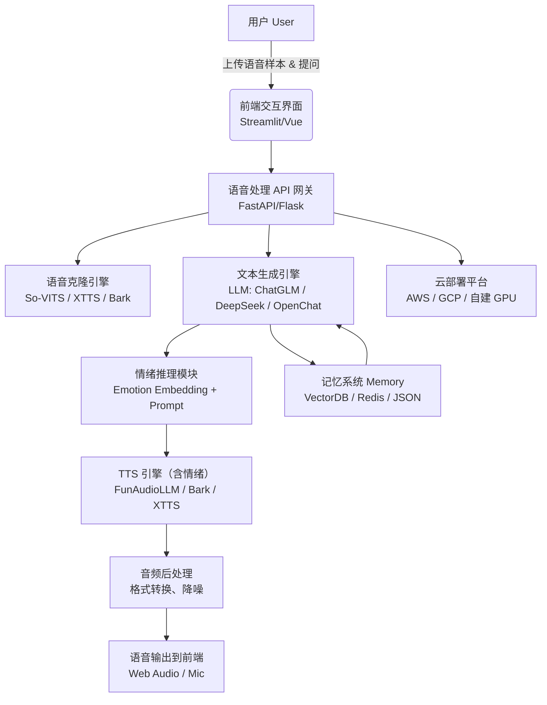

## 🧠 SoulSpeak 技术架构图（Mermaid）

---

## 📌 技术结构说明（中英双语）

### 1. 用户层（User Layer）

* 用户提供：语音样本、文本、提问。
* 语言支持：中文为主，兼容英语。

### 2. 前端层（Frontend）

* 技术选型：`Streamlit` 或 `Vue` + WebSocket。
* 功能：音频上传、语音播放、对话输入输出。

### 3. 中间层（API & Logic）

* 核心组件：

  * FastAPI/Flask 网关负责请求调度。
  * 将用户输入发送给语音克隆引擎与 LLM。

### 4. 模型层（Models & TTS）

* **语音克隆引擎**：

  * `So-VITS-SVC`, `XTTS`, `Bark`（支持中文 + 多情绪）。
* **对话生成**：

  * `ChatGLM`, `OpenChat`, `DeepSeek`，也可选用 GPT 系列。
* **情绪调节**：

  * 情绪识别或用户选择触发情绪 embedding + prompt 工程。
* **TTS with Emotion**：

  * `FunAudioLLM` 为最佳中文情绪控制方案。
  * 备选：`EmotiVoice`, `Edge-TTS`（可自定义表达）

### 5. 后处理（Post-Processing）

* 音频后处理：噪声消除、格式转换、音量标准化。

### 6. 云部署（Cloud Deployment）

* 所有模型运行在 GPU 云端（A100/3090），API 通过内网调用。
* 推荐使用 Docker + Supervisor + Triton Inference Server 统一管理。

---

## 🚀 模块功能分解（可用于 GitHub 子目录）

| 模块          | 功能                  | 技术建议                    |
| ----------- | ------------------- | ----------------------- |
| `/frontend` | 前端界面（Streamlit/Vue） | WebSocket + Audio API   |
| `/api`      | API 调度              | FastAPI/Flask           |
| `/llm`      | 对话生成模块              | ChatGLM, DeepSeek       |
| `/tts`      | TTS & 情绪控制          | XTTS, Bark, FunAudioLLM |
| `/clone`    | 语音克隆模型              | So-VITS, XTTS           |
| `/emotion`  | 情绪建模                | Prompt + embedding      |
| `/memory`   | 记忆系统                | Faiss/Redis/Weaviate    |
| `/docker`   | 云部署配置               | Docker Compose, Triton  |

---

是否继续为你生成每个模块的代码模板或说明？可以从 [语音克隆模块](f)、[情绪感知合成模块](f)，或 [LLM对话模块](f) 开始。
